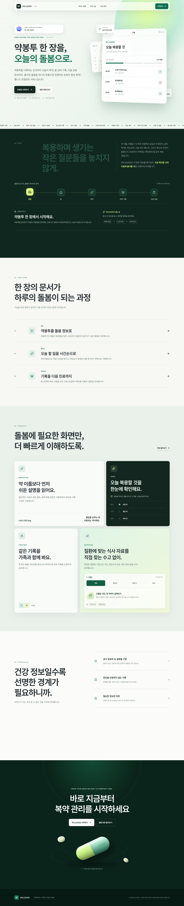
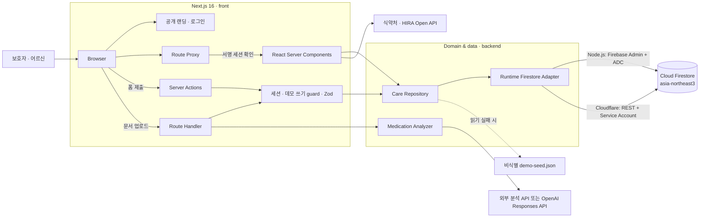

# Care Atlas

> 처방전 한 장을, 오늘의 돌봄으로.

Care Atlas는 처방전의 어려운 표현을 보호자가 이해할 수 있는 말로 정리하고, 매일의 복용 여부와 몸 상태를 다음 진료에 가져갈 기록으로 연결하는 노인 복약·웰니스 컨설턴트입니다.



## 왜 Care Atlas가 필요한가

한국은 이미 국민 5명 중 1명이 노인인 초고령사회이며, 노인 3명 중 1명은 혼자 살고 자녀와 동거하는 비율은 10% 수준에 불과합니다. 동시에 노인의 83.8%가 장기간 처방약을 복용하고 있으며, 일부 노인은 약물 복용 정보 자체를 이해하는 데 어려움을 겪습니다. 여러 약을 동시에 복용하는 고령자에게 어지러움·휘청거림과 같은 작은 변화는 낙상 등 실제 안전 문제와도 연결될 수 있습니다.

따라서 필요한 것은 새로운 의료 판단을 대신하는 AI가 아닙니다.

Care Atlas는 이미 존재하는 처방 정보와 공식 의약품 안전 정보를 보호자가 이해할 수 있는 말과 행동으로 바꾸고, 병원 밖에서 발생하는 실제 복용 여부와 몸 상태를 기록해 다음 진료로 연결하는 도구입니다.

## 1차 MVP에서 실제로 되는 것

1. **돌봄 대시보드** — 현재 복용약, 복용량·횟수·기간, 7일 기록, 의료진 질문을 한 화면에서 확인
2. **쉬운 약 설명** — 전문용어 대신 약의 일반적인 쓰임과 보호자가 살펴볼 변화를 구분해 표시
3. **매일 안부 확인** — 복용 여부, 응답자, 어지러움·두통·졸림 등의 몸 상태를 Firestore에 저장
4. **문서 분석** — 처방전·진단서 이미지 또는 PDF를 분석 API로 보내고 쉬운 말 결과를 즉시 확인. 원본 파일은 저장하지 않음
5. **어르신 프로필** — 연령대, 신체 정보, 알레르기, 확인받은 건강 상태와 보호자 메모 관리
6. **Care Report** — 약 변경과 증상을 인과관계로 단정하지 않고 시간순 기록과 상담 질문으로 정리
7. **식약처 공식 정보 검색** — 약물명을 검색해 식약처 약물 유전 정보 Open API의 일반·유전·제품 정보를 확인
8. **진단서 질병 정보 보강** — 진단명·KCD/ICD 코드를 추출해 건강보험심사평가원 질병정보 API를 우선 조회하고, 미설정·장애·불일치일 때 OpenAI 웹 검색으로 공신력 있는 출처를 보강

Google 계정으로 로그인하거나, 가입 없이 데모 로그인으로 비식별 샘플의 핵심 흐름을 바로 체험할 수 있습니다. 실제 환자 정보는 사용하지 않습니다.

## 아키텍처

Care Atlas는 인증과 데이터 접근을 서버 경계 안에 두는 Next.js 기반 모노레포입니다. 공개 랜딩·로그인 외 앱 경로는 서명된 세션 쿠키를 확인하며, 브라우저는 Firestore와 외부 API에 직접 접근하지 않습니다.



### 요청별 데이터 흐름

| 흐름 | 진입점 | 처리 | 저장 |
|---|---|---|---|
| 화면 조회 | Server Component | 세션 확인 → 저장소 병렬 조회 → 화면 모델 구성 | 없음 |
| 프로필·안부 기록 | Server Action | 세션·데모 모드 확인 → Zod/도메인 검증 → 저장소 호출 | Firestore |
| 문서 분석 | `POST /api/documents/analyze` | 세션·5MB·형식 검증 → 분석 어댑터 → 응답 스키마 확인 | 원본이 아닌 메타데이터와 결과 |
| 공식 정보 | 약·문서 화면 | 식약처/HIRA를 우선 조회하고 필요한 경우에만 AI 보강 | 없음 |

### 보안과 의료 안전 경계

- 세션은 `HttpOnly`, `SameSite=Lax`, 프로덕션 `Secure` 쿠키에 7일 만료 JWT로 저장합니다.
- 앱 경로는 Next.js Proxy가 인증 쿠키를 확인하고, 쓰기 진입점은 서버에서 세션을 다시 검증합니다.
- Firestore 보안 규칙은 브라우저의 직접 읽기·쓰기를 차단합니다.
- 업로드 문서 원본은 영구 저장하지 않고 요청 처리 후 폐기합니다.
- 복약 계획과 실제 응답, 본인 응답과 보호자 관찰을 별도 필드로 보존합니다.
- 생성형 AI는 진단, 복용 중단·용량 변경·대체 약 추천, 증상과 약의 인과관계 판정을 수행하지 않습니다.

## 모노레포 구성

```text
care-atlas/
├── front/
│   ├── src/app/           # App Router, Server Actions, 인증·분석 Route Handler
│   ├── src/components/    # 랜딩, 인증, 도메인, 공통 UI 컴포넌트
│   ├── src/lib/           # 세션, 입력 검증, 화면 모델
│   ├── src/styles/        # 디자인 토큰과 반응형 스타일
│   └── scripts/           # 기능·시각·접근성 QA
├── backend/
│   ├── src/ai/            # OpenAI·외부 분석 제공자 경계
│   ├── src/firestore-*    # Node/Cloudflare 런타임별 Firestore 접근
│   ├── src/official-*     # 식약처·HIRA API 클라이언트
│   └── src/data/          # 비식별 fallback seed
├── design/                # 디자인 시스템과 검증 스크린샷
├── md/                    # 제품·기술·사업성 문서
└── package.json           # npm workspaces 진입점
```

루트 npm 스크립트가 각 워크스페이스 명령을 연결하므로 기존처럼 루트에서 실행하면 됩니다.

## 기술 구성

- Next.js 16 App Router, React 19, TypeScript
- Firebase 프로젝트: `care-atlas-seoul-2026-v2`
- Cloud Firestore: 서울 `asia-northeast3`
- Firebase Admin SDK 또는 Cloudflare용 Firestore REST adapter
- Google OAuth 2.0, `jose` 기반 서명 세션, Next.js Route Proxy
- OpenAI Responses API, 식약처·HIRA Open API
- 화면 조회는 bounded read model 한 문서로 통합하고 원본 이벤트는 하위 컬렉션에 보존
- Zod 입력 검증, Lucide SVG 아이콘
- Noto Sans KR, 딥그린·세이지 기반 접근성 디자인 시스템

브라우저의 Firestore 직접 접근은 보안 규칙으로 모두 차단했습니다. 현재 쓰기는 로그인 세션이 있고 `CARE_ATLAS_DEMO_MODE=true`일 때만 서버에서 실행됩니다. 실제 배포 전에는 사용자별 돌봄 대상자 소유권과 보호자 역할 모델을 추가해야 합니다.

## 빠른 실행

Node.js 22 LTS 또는 24 이상을 권장합니다.

```bash
npm install
gcloud auth application-default login
npm run seed
npm run dev
```

브라우저에서 `http://localhost:3000`을 엽니다.

### 주요 경로

| 경로 | 설명 |
|---|---|
| `/` | 제품 소개와 로그인·데모 진입 랜딩페이지 |
| `/login` | Google OAuth와 비식별 데모 로그인 |
| `/today` | 오늘 복약 일정과 인라인 안부 확인 |
| `/dashboard` | 현재 복용약, 최근 기록, 상담 질문 요약 |
| `/medications` | 쉬운 약 설명과 식약처 공식 정보 검색 |
| `/check-in` | 상세 복약·증상 확인 |
| `/documents` | 처방전·진단서 분석과 출처 확인 |
| `/profile` | 돌봄 대상자 최소 프로필 관리 |
| `/report` | 출력 가능한 최근 7일 Care Report |

Google 로그인은 `care-atlas-seoul-2026-v2` Firebase Authentication의 Google 공급자를 사용합니다. 로컬에서는 Firebase Authentication의 승인된 도메인에 `localhost`가 포함되어 있어야 하며, 서버 세션 서명용 비밀키만 `front/.env.local`에 설정합니다. 설정하지 않아도 데모 로그인은 동작합니다.

```bash
SESSION_SECRET=openssl_rand_base64_32로_생성한_값
```

식약처 공식 약물 정보를 검색하려면 `front/.env.local`에 공공데이터포털 인증키를 설정합니다. 이 값은 서버에서만 사용되며 `.env*`는 `.gitignore`로 커밋 대상에서 제외됩니다.

```bash
MFDS_PARMGEN_API_URL=https://apis.data.go.kr/1471000/ParmgenService
MFDS_PARMGEN_API_KEY=공공데이터포털_일반_인증키
```

문서 분석, 질병 정보 조회, 식약처 약물 정보의 쉬운 설명을 활성화하려면 같은 파일에 다음 서버 전용 값을 설정합니다.

```bash
OPENAI_API_KEY=OpenAI_API_키
OPENAI_MODEL=gpt-5.6-terra
HIRA_DISEASE_API_KEY=공공데이터포털_일반_인증키
```

검증 명령:

```bash
npm run typecheck
npm run lint
npm test
npm run build
```

Cloudflare Workers 빌드·프리뷰·배포:

```bash
npm run cf:build --workspace @care-atlas/front
npm run cf:preview --workspace @care-atlas/front
npm run cf:deploy --workspace @care-atlas/front
```

`front/scripts/visual-qa.mjs`는 320·768·1024·1440px 화면, 확대 텍스트, 수평 오버플로, 콘솔 오류, WCAG 2.1 AA axe 규칙과 주요 터치 타깃을 검사합니다. `functional-qa.mjs`는 인증된 데모 세션에서 안부 기록과 문서 분석의 핵심 흐름을 검증합니다.

Firestore 규칙 배포:

```bash
npm run firebase:deploy
```

## AI 연결 지점

`front/.env.local`에 `AI_ANALYSIS_ENDPOINT`와 `AI_API_KEY`를 추가하면 [medication-analyzer.ts](backend/src/ai/medication-analyzer.ts)의 제공자 독립 인터페이스가 외부 분석 API를 호출합니다. 외부 분석 API가 없고 `OPENAI_API_KEY`가 있으면 OpenAI Responses API가 이미지/PDF를 분석합니다. 진단서는 건강보험심사평가원 질병정보 API를 먼저 확인하며, 공식 정보가 없을 때만 OpenAI 웹 검색으로 전환합니다. 약 검색은 식약처 원문을 먼저 조회한 뒤 원문 내용만 GPT에 전달해 보호자용 쉬운 설명을 만듭니다. 키가 없거나 GPT 호출이 실패해도 식약처 원문은 유지됩니다.

AI를 연결하더라도 다음 경계는 유지합니다.

- OCR 결과를 보호자가 원본과 확인하기 전 약 목록에 반영하지 않음
- 약 이름·상호작용 판단은 공식 데이터와 결정적 규칙으로 처리
- 생성형 AI는 검증된 정보를 쉬운 말로 바꾸는 역할만 수행
- 진단, 복용 중단, 용량 변경, 증상과 약의 인과관계 판정 금지

## 수상 전략에 반영한 제품 결정

- 첫 화면에서 사용자·문제·다음 행동이 설명 없이 보이도록 구성
- 메뉴 수보다 `처방 정보 → 대시보드 → 일일 확인 → Care Report`의 한 흐름을 완성
- 비식별 샘플과 Firestore 시드를 제공해 라이브 데모 실패 가능성 축소
- 불확실성, 출처, 인과관계 비단정 문구를 UI에 직접 구현
- 로딩·성공·오류·빈 상태와 320/768/1024/1440px 반응형 검증

## 문서

- [제품 기획안](md/Care_Atlas_제품_기획안.md)
- [문제 정의 및 필요성 근거 자료](md/Care_Atlas_근거자료.md)
- [수상전략 가이드](md/Codex_Seoul_2026_수상전략_가이드.md)
- [기술 구조와 데이터 모델](md/architecture.md)
- [Value & Viability](md/value-and-viability.md)
- [Codex Build Log](md/codex-build-log.md)

## 프로덕션 전 필수 과제

- 사용자별 돌봄 대상자 소유권, 보호자 초대와 역할 기반 권한
- 공개 인증·분석 엔드포인트의 rate limit, 감사 로그, 이상 사용 탐지
- 동의 이력, 보관 기간, 내보내기와 완전 삭제, 비밀키 회전 정책
- OCR 신뢰도 표시, 이름·주민번호·주소 자동 가리기, 원문 대조·확정 단계
- 식약처 품목·성분 ID 매칭과 HIRA DUR 기반 결정적 안전 규칙
- 의료·약학·개인정보·의료기기 규제 검토와 운영 모니터링·백업·복구

현재 모든 로그인 사용자는 해커톤용 단일 비식별 돌봄 대상을 공유합니다. 실제 건강정보를 입력하거나 건강 의사결정에 사용해서는 안 됩니다.
