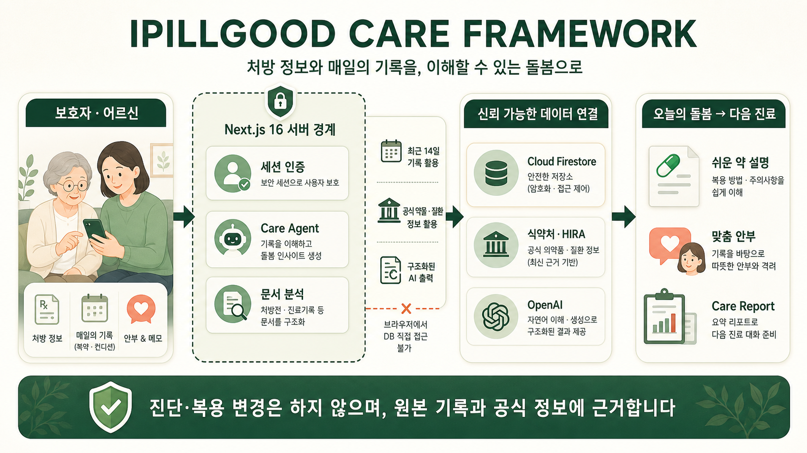
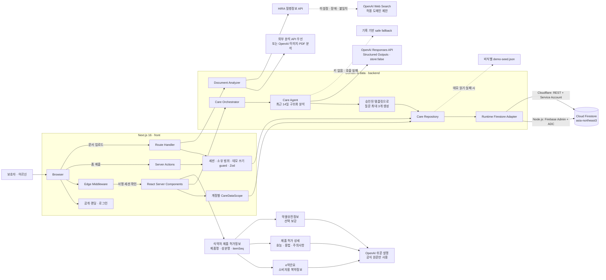

## [실제 데모 바로가기](https://ipillgood.wkddudgk4869.workers.dev/)

# IPILLGOOD

> 처방전 한 장을, 오늘의 돌봄으로.

## 팀 소개

| <a href="https://github.com/hongjiyeon56"></a> | <a href="https://github.com/dkim1112"></a> | <a href="https://github.com/kanade012"></a> | <a href="https://github.com/stringnine"></a> |
|:---:|:---:|:---:|:---:|
| **[홍지연](https://github.com/hongjiyeon56)** | **[김동은](https://github.com/dkim1112)** | **[장영하](https://github.com/kanade012)** | **[지현구](https://github.com/stringnine)** |
| 팀장 · Insight | Insight | Build | Build |

IPILLGOOD는 처방전의 어려운 표현을 보호자가 이해할 수 있는 말로 정리하고, 매일의 복용 여부와 몸 상태를 다음 진료에 가져갈 기록으로 연결하는 고령자 복약·웰니스 컨설턴트입니다.


## 왜 IPILLGOOD가 필요한가

한국은 이미 국민 5명 중 1명이 고령자인 초고령사회이며, 고령자 3명 중 1명은 혼자 살고 자녀와 동거하는 비율은 10% 수준에 불과합니다. 동시에 고령자의 83.8%가 장기간 처방약을 복용하고 있으며, 일부 고령자는 약물 복용 정보 자체를 이해하는 데 어려움을 겪습니다. 여러 약을 동시에 복용하는 고령자에게 어지러움·휘청거림과 같은 작은 변화는 낙상 등 실제 안전 문제와도 연결될 수 있습니다.

따라서 필요한 것은 새로운 의료 판단을 대신하는 AI가 아닙니다.

IPILLGOOD는 이미 존재하는 처방 정보와 공식 의약품 안전 정보를 보호자가 이해할 수 있는 말과 행동으로 바꾸고, 병원 밖에서 발생하는 실제 복용 여부와 몸 상태를 기록해 다음 진료로 연결하는 도구입니다.

## 1차 MVP에서 실제로 되는 것

1. **돌봄 대시보드** — 현재 복용약, 복용량·횟수·기간, 7일 기록, 의료진 질문을 한 화면에서 확인
2. **쉬운 약 설명** — 전문용어 대신 약의 일반적인 쓰임과 보호자가 살펴볼 변화를 구분해 표시
3. **매일 안부 확인** — Care Agent가 최근 기록을 분석하고 승인된 템플릿으로 맞춤 질문을 구성하며, 질문·답변 여부·복용·증상을 Firestore에 분리 저장
4. **문서 분석** — 처방전·진단서 이미지 또는 PDF를 분석 API로 보내고 쉬운 말 결과를 즉시 확인. 원본 파일은 저장하지 않음
5. **어르신 프로필** — 연령대, 신체 정보, 알레르기, 확인받은 건강 상태와 보호자 메모 관리
6. **Care Report** — 약 변경과 증상을 인과관계로 단정하지 않고 시간순 기록과 상담 질문으로 정리
7. **식약처 공식 정보 검색** — 제품명·성분명을 제품 허가정보에서 통합 검색하고, 일반의약품은 e약은요, 전문의약품은 제품 허가 상세의 효능·용법·주의사항을 연결해 확인. 공식 원문이 있으면 OpenAI가 보호자용 쉬운 말 설명을 함께 제공하고 약물유전정보를 선택적으로 보강
8. **진단서 질병 정보 보강** — 진단명·KCD/ICD 코드를 추출해 건강보험심사평가원 질병정보 API를 우선 조회하고, 미설정·장애·불일치일 때 OpenAI 웹 검색으로 공신력 있는 출처를 보강
9. **설치형 PWA 복약 알림** — 로그인 후 현재 기기를 등록하면 Chrome·Safari의 Web Push로 복약 시각을 알리고, 운영자 테스트 발송의 기기 표시 여부까지 확인

Google 계정으로 로그인하면 계정별로 분리된 빈 돌봄 공간을 사용하고, 가입 없이 데모 로그인하면 세션별로 복제된 비식별 샘플로 핵심 흐름을 바로 체험할 수 있습니다. 데모 변경은 다른 방문자에게 보이지 않으며 로그아웃 또는 2시간 만료 후 삭제됩니다. 저장소에 포함된 데모 데이터에는 실제 환자 정보를 사용하지 않습니다.

## 아키텍처

IPILLGOOD는 인증과 데이터 접근을 서버 경계 안에 두는 Next.js 기반 모노레포입니다. 공개 랜딩·로그인 외 앱 경로는 서명된 세션 쿠키를 확인하며, 브라우저는 Firestore와 외부 API에 직접 접근하지 않습니다.





### 요청별 데이터 흐름

| 흐름 | 진입점 | 처리 | 저장 |
|---|---|---|---|
| 화면 조회 | Server Component | 세션 확인 → 계정별 `CareDataScope` 결정 → bounded read model 조회 | 없음 |
| 맞춤 안부 질문 | `/today`, `/check-in` | 최근 14일 기록만 구조화 분석 → event ref 검증 → 승인된 템플릿으로 최대 3개 구성 | `careAnalyses`, `questionSets`, `agentRuns` |
| 프로필·안부 기록 | Server Action | 세션·소유 범위·데모 모드 확인 → Zod/도메인 검증 → 질문 답변과 복약·증상 기록을 원자적으로 저장 | `questionResponses`, 원본 이벤트, read model |
| 문서 분석 | `POST /api/documents/analyze` | 세션·5MB·형식 검증 → 분석 어댑터 → 응답 스키마 확인 | 원본이 아닌 메타데이터와 결과 |
| 공식 약 정보 검색 | `/medications` | 제품명·성분명 통합 조회 → `itemSeq` 기준 e약은요 또는 제품 허가 상세 결합 → 해당 성분의 약물유전정보 보강 → 공식 원문이 있을 때만 쉬운 말 생성 | 없음 |
| 진단서 질병 보강 | 문서 분석 후처리 | HIRA 정확 일치 우선 → 실패한 항목만 허용 도메인 웹 검색 | 분석 결과에 출처 URL 저장 |
| 복약 알림 | `/today`, Cloudflare Cron | 명시적 권한 요청 → 기기별 Push 구독 → 서울 시간 복약 일정 생성 → 매분 도래 일정 조회·중복 방지 발송 | `pushSubscriptions`, `medicationReminderSchedules`, `pushDeliveries` |

### 보안과 의료 안전 경계

- 세션은 `HttpOnly`, `SameSite=Lax`, 프로덕션 `Secure` 쿠키에 7일 만료 JWT로 저장합니다.
- 앱 경로는 Cloudflare 호환 Edge Middleware가 인증 쿠키를 확인하고, 쓰기 진입점은 서버에서 세션을 다시 검증합니다.
- Google 로그인은 Firebase 사용자 ID에서 `google-{uid}` 범위를 만들고 모든 저장소 호출에서 대상 ID 일치를 검사합니다. 데모 로그인은 서버가 만든 임시 UUID 범위와 만료 레코드를 함께 검증합니다.
- Firestore 보안 규칙은 브라우저의 직접 읽기·쓰기를 차단합니다.
- 업로드 문서 원본은 영구 저장하지 않고 요청 처리 후 폐기합니다.
- 복약 계획과 실제 응답, 본인 응답과 보호자 관찰을 별도 필드로 보존합니다.
- Care Agent 입력은 대상자의 최소 프로필, 활성 약, 목표일 이전 최근 14일 복약·증상 기록으로 제한하며 프로필 메모와 문서 안의 명령문을 실행 지시로 취급하지 않습니다.
- AI 출력은 JSON Schema와 Zod로 검증하고, 실제 입력에 없는 이벤트 참조는 제거합니다. 질문 문구와 선택지는 코드에 승인된 템플릿으로만 구성합니다.
- 생성형 AI는 진단, 복용 중단·용량 변경·대체 약 추천, 증상과 약의 인과관계 판정을 수행하지 않습니다.
- Push endpoint 허용 목록은 [`front/src/lib/push/endpoint.ts`](front/src/lib/push/endpoint.ts)에서 관리합니다. Windows Edge의 WNS도 포함하며 HTTPS와 정확한 호스트 경계를 검사합니다. 알림 본문에는 약 이름이나 진단명 대신 일반적인 복약 확인 문구만 표시합니다.
- 동일한 복약 회차는 결정적 delivery ID로 한 번만 처리하고, 30분보다 오래 지난 일정은 뒤늦게 발송하지 않습니다. 만료된 구독은 Push 서비스의 404·410 응답 시 비활성화합니다.

## 모노레포 구성

```text
care-atlas/
├── front/
│   ├── src/app/           # App Router, Server Actions, 인증·분석 Route Handler
│   ├── src/components/    # 랜딩, 인증, 도메인, 공통 UI 컴포넌트
│   ├── src/lib/           # 세션, 입력 검증, 화면 모델
│   ├── src/styles/        # 디자인 토큰과 반응형 스타일
│   └── scripts/           # 기능·시각·접근성 QA
├── backend/
│   ├── src/ai/            # Care Agent, 질문 템플릿, OpenAI·외부 분석 제공자 경계
│   ├── src/care-orchestration-service.ts # 질문 세트 캐시·생성·폴백 조정
│   ├── src/firestore-*    # Node/Cloudflare 런타임별 Firestore 접근
│   ├── src/official-*     # 식약처·HIRA API 클라이언트
│   └── src/data/          # 비식별 fallback seed
├── design/                # 디자인 시스템과 검증 스크린샷
├── md/                    # 제품·기술·사업성 문서
└── package.json           # npm workspaces 진입점
```

루트 npm 스크립트가 각 워크스페이스 명령을 연결하므로 기존처럼 루트에서 실행하면 됩니다.

## 기술 구성

- Next.js 16 App Router, React 19, TypeScript
- Firebase 프로젝트: `care-atlas-seoul-2026-v2`
- Cloud Firestore: 서울 `asia-northeast3`
- Firebase Admin SDK 또는 Cloudflare용 Firestore REST adapter
- Google OAuth 2.0, `jose` 기반 서명 세션, Cloudflare 호환 Edge Middleware
- OpenAI Responses API, 식약처·HIRA Open API
- Google 로그인은 계정별 `CareDataScope`, 데모 로그인은 세션별 임시 비식별 scope로 분리
- 화면 조회는 bounded read model 한 문서로 통합하고 원본 이벤트와 AI 분석·질문·응답·실행 이력은 하위 컬렉션에 보존
- Zod 입력 검증, Lucide SVG 아이콘
- Noto Sans KR, 딥그린·세이지 기반 접근성 디자인 시스템

브라우저의 Firestore 직접 접근은 보안 규칙으로 모두 차단했습니다. Google 로그인은 계정별 돌봄 범위에서 바로 읽고 쓸 수 있습니다. 데모는 `IPILLGOOD_DEMO_MODE=true`일 때 서버가 방문자별 임시 범위를 만들며, 운영에서는 `isolated` 모드와 정확한 허용 호스트가 함께 설정된 경우에만 로그인할 수 있습니다. 여러 보호자가 한 대상을 함께 돌보는 초대·역할 기반 권한 모델은 실제 배포 전에 추가해야 합니다.

## 빠른 실행

Node.js 22 LTS 또는 24 이상을 권장합니다.

```bash
npm install
gcloud auth application-default login
npm run seed
npm run dev
```

브라우저에서 `http://localhost:3000`을 엽니다.

### 주요 경로

| 경로 | 설명 |
|---|---|
| `/` | 제품 소개와 로그인·데모 진입 랜딩페이지 |
| `/login` | Google OAuth와 비식별 데모 로그인 |
| `/today` | 오늘 복약 일정과 인라인 안부 확인 |
| `/dashboard` | 현재 복용약, 최근 기록, 상담 질문 요약 |
| `/medications` | 쉬운 약 설명과 식약처 공식 정보 검색 |
| `/check-in` | 상세 복약·증상 확인 |
| `/documents` | 처방전·진단서 분석과 출처 확인 |
| `/profile` | 돌봄 대상자 최소 프로필 관리 |
| `/report` | 출력 가능한 최근 7일 Care Report |

Google 로그인은 `care-atlas-seoul-2026-v2` Firebase Authentication의 Google 공급자를 사용합니다. 로컬에서는 Firebase Authentication의 승인된 도메인에 `localhost`가 포함되어 있어야 하며, 서버 세션 서명용 비밀키를 `front/.env.local`에 설정합니다. 데모 로그인도 고정 fallback 키를 사용하지 않으므로 `openssl rand -base64 32`처럼 생성한 충분히 강한 `SESSION_SECRET`이 필요합니다. 운영 데모는 `IPILLGOOD_PUBLIC_DEMO_MODE=isolated`와 `IPILLGOOD_DEMO_ALLOWED_HOSTS`의 정확한 호스트가 모두 일치해야 합니다.

운영 배포 전에는 Firebase Console에서 Authentication을 초기화하고 Google 공급자를 활성화한 뒤, 실제 서비스 호스트를 **Authentication > 설정 > 승인된 도메인**에 추가해야 합니다. 이 단계가 빠지면 클라이언트에서 `auth/configuration-not-found` 또는 `auth/unauthorized-domain` 오류가 발생합니다.

```bash
SESSION_SECRET=openssl_rand_base64_32로_생성한_값
CONNECTION_CODE_SECRET=별도로_생성한_openssl_rand_base64_32_값
```

Google 계정 소유자는 `/profile`에서 10분 안에 최초 입력해야 하는 연결 코드를 발급할 수 있습니다. 최초 연결 뒤에는 같은 코드로 다시 로그인할 수 있으며, 새 기기에서 로그인하면 이전 연결 세션은 교체되어 한 계정당 연결 기기 한 대만 유지됩니다. 로그아웃은 현재 기기 세션만 종료하고, 연결은 30일 미사용, 소유자의 연결 해제 또는 회원 탈퇴 시 종료됩니다. 운영 Cloudflare 환경에는 코드 HMAC용 값을 별도 secret으로 등록합니다.

```bash
cd front
npx wrangler secret put CONNECTION_CODE_SECRET
```

식약처 공식 약물 정보를 검색하려면 `front/.env.local`에 공공데이터포털 인증키를 설정합니다. 이 값은 서버에서만 사용되며 `.env*`는 `.gitignore`로 커밋 대상에서 제외됩니다.

```bash
MFDS_PRODUCT_API_URL=https://apis.data.go.kr/1471000/DrugPrdtPrmsnInfoService07
MFDS_EASY_DRUG_API_URL=https://apis.data.go.kr/1471000/DrbEasyDrugInfoService
MFDS_PARMGEN_API_URL=https://apis.data.go.kr/1471000/ParmgenService
MFDS_MEDICATION_API_KEY=공공데이터포털_일반_인증키
# 약물 유전 정보가 별도 키로 승인된 경우
MFDS_PARMGEN_API_KEY=약물유전정보_인증키
```

공공데이터포털에서 의약품 제품 허가정보와 의약품개요정보(e약은요) 활용 신청을 완료한 프로젝트 키를 `MFDS_MEDICATION_API_KEY`에 저장합니다. 약물 유전 정보가 다른 프로젝트 키로 승인된 경우 `MFDS_PARMGEN_API_KEY`를 함께 설정합니다. 제품·e약 키가 없을 때는 기존 배포의 약물유전 키를 전환 호환용으로 읽습니다.

전문의약품은 e약은요 수록 대상이 아니므로 같은 제품 허가정보 서비스의 상세 조회에서 효능·효과, 용법·용량, 사용상 주의사항, 보관방법을 가져옵니다. 별도 키는 필요하지 않으며 `MFDS_MEDICATION_API_KEY`를 함께 사용합니다.

문서 분석과 질병 정보 조회를 활성화하려면 같은 파일에 다음 서버 전용 값을 설정합니다.

```bash
OPENAI_API_KEY=OpenAI_API_키
OPENAI_MODEL=gpt-5.6-luna
HIRA_DISEASE_API_KEY=공공데이터포털_일반_인증키
```

`OPENAI_API_KEY`가 있으면 공식 약 원문을 `store:false` 구조화 응답으로 쉬운 말로 바꿉니다. 공식 원문이 없는 항목은 모델이 내용을 만들어내지 않으며, OpenAI가 미설정이거나 실패해도 식약처 원문과 의약품안전나라 상세 링크는 계속 표시합니다.

검증 명령:

```bash
npm run typecheck
npm run lint
npm test
npm run build
```

실제 OpenAI·식약처 키로 비식별 처방전/진단서 이미지, 공식 제품·성분 검색, Care Agent를 연쇄 검증하려면:

```bash
OPENAI_API_KEY=... MFDS_MEDICATION_API_KEY=... npm run verify:live --workspace @care-atlas/backend
```

Cloudflare Workers 빌드·프리뷰·배포:

```bash
npm run cf:build --workspace @care-atlas/front
npm run cf:preview --workspace @care-atlas/front
npm run cf:deploy --workspace @care-atlas/front
```

### PWA 복약 알림 설정과 검증

Web Push는 페이지를 닫아도 서비스 워커가 Chrome 또는 Safari의 시스템 알림을 표시합니다. 알림 섹션은 모바일 브라우저와 설치형 PWA에서만 표시하며, iPhone·iPad는 iOS/iPadOS 16.4 이상에서 홈 화면에 설치한 PWA로 실행해야 합니다. 사용자가 `이 기기에서 알림 받기` 버튼을 눌러 브라우저 권한을 허용해야 합니다.

VAPID 키와 Cron 인증값을 한 번 생성합니다. 출력된 값은 저장소에 커밋하지 않습니다.

```bash
npm run push:keys --workspace @care-atlas/front
```

로컬에서는 출력값을 `front/.env.local`에 넣습니다.

```bash
VAPID_PUBLIC_KEY=...
VAPID_PRIVATE_KEY=...
VAPID_SUBJECT=mailto:운영자_이메일
PUSH_CRON_SECRET=...
PUSH_OPERATOR_SECRET=...
```

Cloudflare 운영 환경에는 같은 다섯 값을 secret으로 등록합니다. 기존 Firestore REST 연결을 위한 `FIREBASE_SERVICE_ACCOUNT_JSON`도 설정되어 있어야 합니다.

```bash
cd front
npx wrangler secret put VAPID_PUBLIC_KEY
npx wrangler secret put VAPID_PRIVATE_KEY
npx wrangler secret put VAPID_SUBJECT
npx wrangler secret put PUSH_CRON_SECRET
npx wrangler secret put PUSH_OPERATOR_SECRET
cd ..
npm run cf:deploy --workspace @care-atlas/front
```

`front/wrangler.jsonc`의 Cron은 매분 실행됩니다. 서버는 복약 계획의 시작일·종료일·횟수·복용 시점을 서울 시간으로 계산해 다음 알림만 조회하고, 실제 Push는 해당 회차부터 30분 동안만 유효합니다. 현재 시간 규칙은 아침 08:00, 점심 13:00, 저녁 19:00, 취침 전 21:00이며, 시간 표현이 없는 1~4회 일정은 횟수별 기본 시각을 사용합니다.

처방전 분석으로 복약 계획이 등록되거나 해당 문서가 삭제되면 서버가 최신 복약 목록으로 알림 일정을 즉시 동기화합니다. 일시적인 Firestore 오류는 한 번 재시도하며, 사용자가 알림을 먼저 허용한 경우와 복약 계획을 먼저 등록한 경우 모두 같은 기기·복약 슬롯을 upsert해 중복 일정을 만들지 않습니다.

운영 도착 검증은 로그인 후 `/today`에서 다음 순서로 진행합니다.

1. PWA를 설치하고 `이 기기에서 알림 받기`를 누른 뒤 권한을 허용합니다.
2. 카드에 다음 복약 시각이 표시되는지 확인합니다.
3. 앱을 완전히 닫고 다음 복약 시각의 알림이 시스템 알림센터에 표시되는지 확인합니다.

로컬 Chrome 서비스 워커 표시 경로, WCAG 2.1 AA, 320·768·1024·1440px 오버플로를 자동 검증하려면 Playwright 모듈 경로와 실행 중인 앱 주소를 전달합니다.

```bash
IPILLGOOD_BASE_URL=http://localhost:3000 \
IPILLGOOD_PLAYWRIGHT=/absolute/path/to/playwright/index.js \
npm run qa:push --workspace @care-atlas/front
```

Push 서비스의 HTTP 성공은 브라우저 서비스가 메시지를 접수했다는 뜻이며 기기가 오프라인이거나 OS 알림이 차단된 경우 즉시 표시를 보장하지는 않습니다. IPILLGOOD는 서비스 워커가 `showNotification`을 완료한 뒤 서버에 표시 receipt를 남겨 접수와 실제 표시를 구분합니다.

운영자가 등록된 특정 기기로 직접 테스트할 때는 `PUSH_OPERATOR_SECRET`을 헤더에 넣고 `/api/push/operator-test`에 Firebase UID와 해당 Push 기기 ID를 전달합니다. 응답의 `deliveryId`를 같은 엔드포인트의 GET 요청으로 조회하면 푸시 서비스 접수 상태와 기기 표시 receipt를 분리해 확인할 수 있습니다. 비밀값과 기기 ID는 클라이언트 코드나 로그에 남기지 않습니다.

운영 주소: <https://ipillgood.wkddudgk4869.workers.dev>

`front/scripts/visual-qa.mjs`는 320·768·1024·1440px 화면, 확대 텍스트, 수평 오버플로, 콘솔 오류, WCAG 2.1 AA axe 규칙과 주요 터치 타깃을 검사합니다. `functional-qa.mjs`는 인증된 데모 세션에서 안부 기록과 문서 분석의 핵심 흐름을 검증합니다.

Firestore 규칙 배포:

```bash
npm run firebase:deploy
```

## AI 연결 지점

현재 생성형 AI는 세 군데에서 사용합니다. 모든 OpenAI 요청은 Responses API에 `store: false`, 낮은 reasoning effort, 30초 timeout을 적용하며 기본 모델은 `OPENAI_MODEL` 또는 `gpt-5.6-luna`입니다.

| 기능 | AI 입력 | AI 출력과 후처리 | 실패 시 동작 |
|---|---|---|---|
| Care Agent 맞춤 안부 | 최소 프로필, 활성 약, 목표일 이전 최근 14일 복약·증상 이벤트 | `care-agent.v1` Structured Output → Zod 검증 → 존재하는 event ID만 허용 → 코드의 승인 템플릿으로 질문 최대 3개 생성 | 같은 기록을 결정적 규칙으로 분석하는 `safe_fallback`; 안부 기능은 계속 동작 |
| 처방전·진단서 분석 | 요청 중 메모리에만 둔 이미지/PDF | 문서 사실, 돌봄 확인점, 의료진 질문, 진단명·코드를 JSON Schema로 추출 | 외부 분석 API가 설정되면 그 제공자를 우선 사용; 어떤 분석기도 없으면 실제 파일 분석은 503, 비식별 샘플은 데모 결과 제공 |
| 진단서 질병 정보 | 문서에서 추출한 진단명·KCD/ICD 코드 | HIRA 정확 일치를 우선 사용하고, 실패한 항목만 OpenAI 웹 검색으로 보강해 출처 URL과 함께 반환 | 공식·웹 결과가 없다는 상태를 명시하고 추측하지 않음 |

### Care Agent 실행 흐름

1. `getOrCreateQuestionSet`이 계정별 돌봄 snapshot에서 목표일 이전 기록만 잘라 SHA-256 입력 revision을 만듭니다. 당일 답변은 입력에서 제외해 제출 직후 질문 세트가 바뀌지 않게 합니다.
2. 대상자·날짜·응답자·입력 revision·프롬프트 버전으로 결정적인 질문 세트 ID를 만들고, 이미 저장된 세트가 있으면 AI를 다시 호출하지 않습니다.
3. Care Agent는 최근 변화, 반복 증상, 미복용·미확인 기록을 구조화해 반환합니다. 모델이 입력에 없던 이벤트 ID를 만들면 서버가 해당 finding과 reference를 제거합니다.
4. 모델은 사용자에게 보일 질문 문장을 직접 쓰지 않습니다. `generate-question-set.ts`가 검증된 finding을 증상 추적, 복약 어려움, 새 약 관찰, 일상 상태 템플릿에 연결합니다.
5. 분석 결과, 질문 세트, 실행 메타데이터를 각각 `careAnalyses`, `questionSets`, `agentRuns`에 저장합니다. 프롬프트·출력 스키마 버전, 입력·출력 참조, 성공·미설정·실패 상태를 남깁니다.
6. 제출된 답변은 `questionResponses`에 별도로 보존하고, 같은 batch에서 복약·증상 이벤트, 일일 체크인, bounded read model을 갱신합니다. 생성 결과가 원본 기록을 덮어쓰지 않습니다.

### 문서·공식 정보 라우팅

`front/.env.local`에 `AI_ANALYSIS_ENDPOINT`와 `AI_API_KEY`를 추가하면 [medication-analyzer.ts](backend/src/ai/medication-analyzer.ts)의 제공자 독립 인터페이스가 외부 문서 분석 API를 우선 호출합니다. 두 값이 없고 `OPENAI_API_KEY`가 있으면 [openai-medical.ts](backend/src/ai/openai-medical.ts)가 OpenAI로 이미지/PDF를 직접 분석합니다.

진단서는 문서 분석 후 HIRA 질병정보를 먼저 확인합니다. 정확한 코드·이름 매칭이 없거나 API가 설정되지 않았거나 일시적으로 실패한 항목만 OpenAI 웹 검색으로 전환하며, 검색 도메인은 질병관리청·HIRA·국민건강보험·대학병원·WHO·CDC·MedlinePlus로 제한합니다. 검색 출처를 받지 못하면 결과를 폐기합니다.

약 검색은 [official-medication-search.ts](backend/src/official-medication-search.ts)가 식약처 의약품 제품 허가정보에서 제품명과 성분명을 각각 조회하고 `itemSeq`로 중복을 제거합니다. 일반의약품은 e약은요 소비자용 설명을 우선하고, e약은요가 없는 전문의약품은 제품 허가 상세의 효능·효과, 용법·용량, 사용상 주의사항, 보관방법을 폴백으로 연결합니다. 약물유전정보는 공식 제품 결과의 성분과 일치할 때만 보강하고, OpenAI 쉬운 설명도 이 공식 원문 범위 안에서만 생성합니다. 키 미설정·API 장애·무결과는 서로 다른 상태로 반환하며, 고정 예시나 웹 검색 결과로 약품 식별을 대체하지 않습니다.

AI를 연결하더라도 다음 경계는 유지합니다.

- OCR 결과를 보호자가 원본과 확인하기 전 약 목록에 반영하지 않음
- 모델 출력이 원본 복약·증상 이벤트나 복약 계획을 수정하지 않음
- 미응답을 정상 또는 복용 완료로 해석하지 않고, 증상과 약의 시간적 관계를 인과관계로 바꾸지 않음
- 질문과 선택지는 승인된 템플릿으로만 노출하고 분석 근거를 원본 event reference로 추적
- 약 이름·상호작용 판단은 공식 데이터와 결정적 규칙으로 처리
- 진단, 복용 중단, 용량 변경, 증상과 약의 인과관계 판정 금지

## 문서

- [저장·알림 안정성, 로컬·CI 전체 검증 및 운영 복구](docs/backend-reliability.md) — 깨끗한 checkout에서 `npm ci`, `npx playwright install --with-deps chromium` 후 `npm run verify -- --account-full-cycle` (PR·main CI와 동일)
- [제품 기획안](md/IPILLGOOD_제품_기획안.md)
- [문제 정의 및 필요성 근거 자료](md/IPILLGOOD_근거자료.md)
- [기술 구조와 데이터 모델](md/architecture.md)
- [Value & Viability](md/value-and-viability.md)
- [Codex Build Log](md/codex-build-log.md)

## 프로덕션 전 필수 과제

- 여러 보호자가 한 돌봄 대상을 공유하는 초대, 역할 기반 권한, 소유권 이전
- 공개 인증·분석 엔드포인트의 rate limit, 감사 로그, 이상 사용 탐지
- 동의 이력, 보관 기간, 내보내기와 완전 삭제, 비밀키 회전 정책
- OCR 신뢰도 표시, 이름·주민번호·주소 자동 가리기, 원문 대조·확정 단계
- 식약처 품목·성분 ID 매칭과 HIRA DUR 기반 결정적 안전 규칙
- 의료·약학·개인정보·의료기기 규제 검토와 운영 모니터링·백업·복구

현재 Google 로그인 사용자의 데이터는 Firebase 사용자 ID에서 파생한 별도 돌봄 범위에 저장됩니다. 데모 로그인은 방문자마다 별도 비식별 범위를 사용하고 로그아웃 또는 2시간 만료 후 하위 기록까지 정리합니다. 아직 의료 서비스 운영을 위한 권한·동의·감사 체계를 갖춘 상태가 아니므로 실제 건강정보를 입력하거나 건강 의사결정에 사용해서는 안 됩니다.
