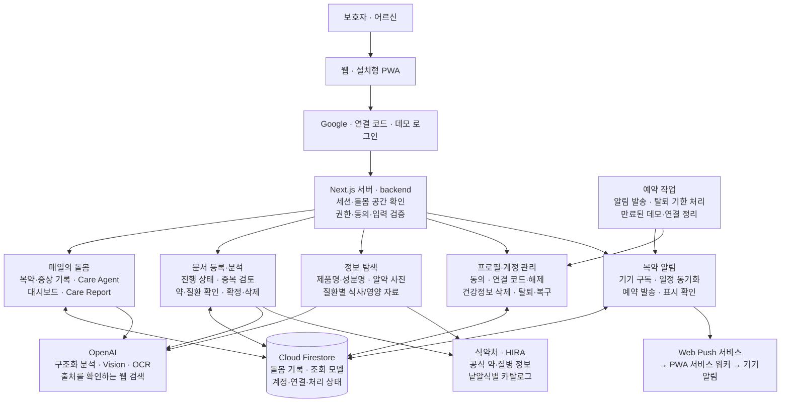
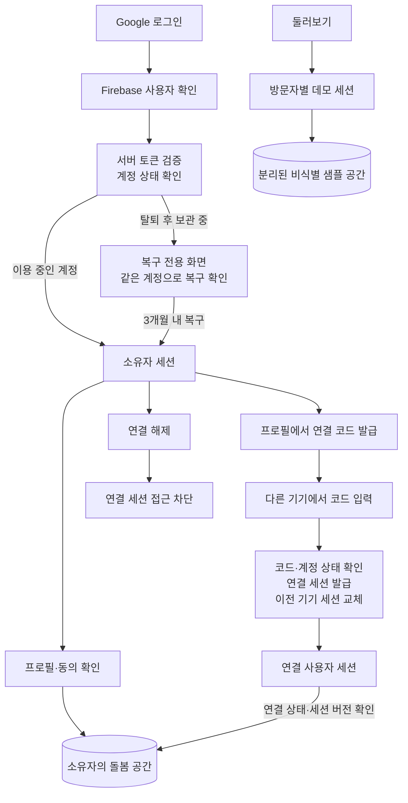
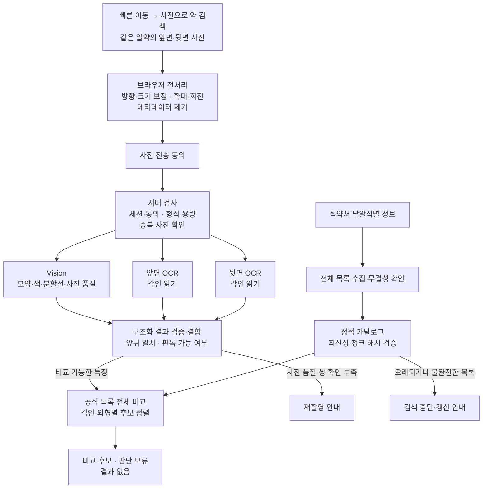

# IPILLGOOD

> 처방전 한 장을, 오늘의 돌봄으로.

IPILLGOOD는 어려운 처방 정보를 쉬운 말로 정리하고, 매일의 복약과 몸 상태를 가족이 함께 살펴 다음 진료에 가져갈 기록으로 연결하는 고령자 복약·웰니스 서비스입니다.

**[서비스 둘러보기](https://ipillgood.wkddudgk4869.workers.dev/)** · [제품 기획](md/IPILLGOOD_제품_기획안.md) · [개발·운영 안내](docs/development-guide.md)

## 어떤 문제를 해결하나요?

여러 약을 복용하다 보면 약마다 다른 복용 방법을 기억하고, 빠뜨린 약이나 몸 상태의 변화를 꾸준히 기록하기 어렵습니다. 떨어져 사는 가족은 오늘 약을 챙겼는지 확인하기 어렵고, 다음 진료에서는 그동안의 변화를 기억에 의존해 설명하게 됩니다.

IPILLGOOD는 처방전·약봉투에 적힌 정보, 식약처 공식 약 정보, 실제 복약·증상 기록을 연결합니다. 보호자는 오늘 확인할 일을 파악하고, 어르신과 함께 남긴 기록을 의료진에게 보여줄 수 있습니다. [문제 정의와 근거 자료](md/IPILLGOOD_근거자료.md)

## 무엇을 할 수 있나요?

| 기능 | 이용 방법 |
|---|---|
| 오늘 할 일 | 예정된 복약과 완료 여부를 보고, 복용 여부와 오늘 몸 상태를 기록합니다. |
| 맞춤 안부 확인 | 최근 기록을 바탕으로 구성한 질문에 답합니다. 본인 응답과 보호자의 관찰을 구분해 남깁니다. |
| 처방전·약봉투·진단서 등록 | 이미지나 PDF에서 내용을 정리합니다. 약과 복용 일정을 원본과 대조해 수정·확정하고, 진단서에서 확인한 질환도 검토해 프로필에 반영합니다. |
| 복용약과 공식 정보 검색 | 복용약을 확인하고 제품명·성분명으로 식약처 정보를 찾습니다. 효능·용법·주의사항과 쉬운 설명, 공식 출처를 함께 봅니다. |
| 사진으로 약 검색 | 같은 알약의 앞뒤 사진을 올려 외형·각인이 비슷한 공식 품목을 비교합니다. 후보, 판단 보류, 재촬영 안내를 구분해 보여줍니다. |
| 식사/영양 자료 탐색 | 확인받은 질환을 선택해 관련 한국어 병원·학회 자료, 블로그와 영상의 요약·원문 링크를 확인합니다. |
| 돌봄 대시보드와 Care Report | 복용약·최근 기록·의료진에게 물어볼 질문을 모아 보고, 최근 7일 보고서를 출력합니다. |
| 프로필 관리 | 돌봄 대상자의 기본 정보, 알레르기, 확인받은 질환, 보호자 메모와 건강정보 처리 동의를 관리합니다. |
| 연결 코드 로그인 | 계정 소유자가 발급한 코드로 다른 기기에서 로그인해 같은 돌봄 공간을 이용합니다. |
| PWA 복약 알림 | 홈 화면에 앱을 설치하고 프로필에서 기기 알림을 켜면 예정된 복약 시각에 알림을 받습니다. |
| 데이터·계정 관리 | 건강정보 삭제, 연결 해제, 회원 탈퇴를 선택할 수 있습니다. 탈퇴 후 3개월 안에는 같은 Google 계정으로 복구를 확인할 수 있습니다. |

사진 검색 결과는 약을 확정하거나 복용약에 자동 등록하지 않습니다. 문서에서 추출한 약도 사용자가 원본과 확인하고 확정한 뒤 복약 일정에 반영됩니다.

## 이렇게 시작하세요

1. **둘러보기 또는 로그인** — 가입 없이 비식별 샘플로 체험하거나 Google 계정으로 나만의 돌봄 공간을 만듭니다. 연결 코드를 받았다면 코드로 로그인합니다.
2. **돌봄 정보 확인** — 대상자 프로필과 건강정보 처리 동의를 확인하고 처방전·약봉투를 등록합니다.
3. **매일 기록** — 오늘 할 일에서 복약을 확인하고 몸 상태를 남깁니다. 필요한 기록·문서 등록·사진 검색은 가운데 **빠른 이동**에서 엽니다.
4. **함께 확인하고 진료 준비** — 연결된 기기에서 같은 기록을 확인하고, 대시보드와 Care Report로 다음 진료를 준비합니다.

모바일 하단 메뉴는 **오늘 할 일 · 복용약 · 빠른 이동 · 식사/영양 · 프로필**입니다. 화면 맨 위에서 아래로 당겨 새로고침할 수 있고, 알림과 계정 설정은 프로필에 모여 있습니다. 로그인에 실패하면 다시 시도하거나 로그인 화면을 새로 열 수 있습니다.

데모는 방문자마다 별도 샘플을 사용하므로 변경한 내용이 다른 방문자에게 보이지 않습니다. iPhone·iPad의 복약 알림은 홈 화면에 설치한 PWA에서 권한을 허용해 사용합니다.

## 서비스 아키텍처

Next.js가 화면과 서버 요청을 처리하고, 백엔드가 돌봄 기록·문서 분석·공식 정보 조회·알림·계정 관리를 담당합니다. Google 로그인과 연결 코드 로그인은 같은 돌봄 공간으로 연결될 수 있으며, 데모는 별도 공간으로 분리됩니다. 건강 데이터는 서버의 인증·권한·동의 검사를 거쳐 접근합니다.

### 전체 구조

문서 분석은 별도 외부 분석 API가 설정되어 있으면 우선 사용하고, 그렇지 않으면 OpenAI를 사용합니다. 문서에서 약과 일정을 확정하거나 문서를 삭제하면 복약 알림 일정을 함께 갱신합니다. 확인한 질환은 프로필과 식사/영양 자료 탐색으로 이어집니다. 진단서의 질병 정보는 HIRA를 우선 조회하고, 일치 정보가 없거나 조회에 실패하면 출처를 확인하는 웹 검색으로 보강합니다.

복약·증상·프로필과 문서 분석 결과는 돌봄 공간별로 저장합니다. 사진 검색의 사진·결과는 앱에 보관하지 않으며, 식사/영양 검색은 개인 기록 대신 공개 질환별 검색 결과만 캐시합니다. 문서의 원본 이미지·PDF도 영구 저장하지 않습니다.

### Google 로그인과 연결 코드 로그인

연결 코드는 계정 소유자의 돌봄 공간을 다른 기기에서 이용하는 수단입니다. 두 Google 계정의 데이터를 합치는 기능은 아닙니다. 현재 추가 연결은 한 대만 유지하며, 소유자가 프로필에서 연결을 해제할 수 있습니다.

최초 연결 코드는 발급 후 10분 안에 입력합니다. 연결 후에는 같은 코드로 다시 로그인할 수 있고, 새 기기로 로그인하면 이전 연결 기기의 세션을 교체합니다. 연결은 30일 미사용, 소유자의 해제 또는 탈퇴 시 종료됩니다. 연결 사용자는 계정 소유자의 연결 발급·탈퇴·건강정보 삭제 권한을 갖지 않습니다.

### 사진으로 약을 찾는 흐름

사진에서 관찰한 특징을 공식 목록과 비교합니다. AI가 약 이름을 직접 결정하지 않으며, 사진이 흐리거나 앞뒤를 판별하기 어려우면 재촬영을 안내합니다.

## 개인정보와 결과 해석

- 건강정보 처리 동의를 확인하고, 로그인한 사용자가 접근할 수 있는 돌봄 공간만 조회·수정합니다.
- 사진과 문서는 분석을 위해 외부 제공자에게 전달될 수 있습니다. 앱의 원본 미저장이 외부 제공자의 모든 보관 정책까지 없애는 것은 아닙니다.
- 복약 계획과 실제 복용 기록을 구분합니다. 미응답을 복용 완료나 정상 상태로 해석하지 않습니다.
- 탈퇴하면 이용과 알림을 중단하고 기록을 3개월간 복구용으로 보관한 뒤 영구 삭제합니다. 별도의 건강정보 삭제는 본인 확인과 삭제 범위 확인을 거쳐 진행합니다.
- 서비스는 진단, 복용 중단·용량 변경·대체 약 추천을 하지 않습니다. 사진 후보와 AI 설명을 의료진·약사의 확인을 대신하는 근거로 사용하지 마세요. 데모에는 비식별 정보만 사용합니다.

## 기술과 관련 문서

화면은 **Next.js · React · TypeScript**, 인증·데이터는 **Firebase Authentication · Cloud Firestore**, 앱 실행과 예약 작업은 **Cloudflare Workers**, 분석은 **OpenAI**와 **식약처·HIRA 공식 정보**를 사용합니다.

- [문서 색인](docs/README.md) · [개발·운영 안내](docs/development-guide.md) — 로컬 실행, 외부 연동 설정, 검증과 배포
- [PWA 탐색과 로그인 복구](docs/pwa-navigation.md) · [사진 검색 상세 구조](docs/pill-photo-web.md)
- [식사/영양 자료 탐색](docs/nutrition-exploration.md) · [탈퇴·복구 정책](docs/account-deletion.md)
- [제품 기획안](md/IPILLGOOD_제품_기획안.md) · [문제 정의와 근거](md/IPILLGOOD_근거자료.md) · [사업성](md/value-and-viability.md)

## 팀 소개

|  |  |  |  |
|:---:|:---:|:---:|:---:|
| **[홍지연](https://github.com/hongjiyeon56)** | **[김동은](https://github.com/dkim1112)** | **[장영하](https://github.com/kanade012)** | **[지현구](https://github.com/stringnine)** |
| 팀장 · Insight | Insight | Build | Build |
