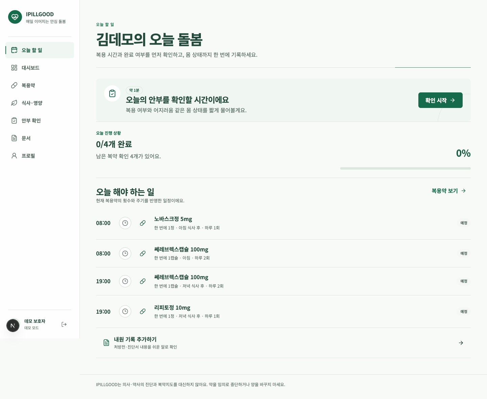

# Care Atlas

> 처방전은 병원에서 끝나지만, 돌봄은 매일 이어집니다.

Care Atlas는 처방전의 어려운 표현을 보호자가 이해할 수 있는 말로 정리하고, 매일의 복용 여부와 몸 상태를 다음 진료에 가져갈 기록으로 연결하는 노인 복약·웰니스 컨설턴트입니다.



## 1차 MVP에서 실제로 되는 것

1. **돌봄 대시보드** — 현재 복용약, 복용량·횟수·기간, 7일 기록, 의료진 질문을 한 화면에서 확인
2. **쉬운 약 설명** — 전문용어 대신 약의 일반적인 쓰임과 보호자가 살펴볼 변화를 구분해 표시
3. **매일 안부 확인** — 복용 여부, 응답자, 어지러움·두통·졸림 등의 몸 상태를 Firestore에 저장
4. **문서 분석** — 처방전·진단서 이미지 또는 PDF를 분석 API로 보내고 쉬운 말 결과를 즉시 확인. 원본 파일은 저장하지 않음
5. **어르신 프로필** — 연령대, 신체 정보, 알레르기, 확인받은 건강 상태와 보호자 메모 관리
6. **Care Report** — 약 변경과 증상을 인과관계로 단정하지 않고 시간순 기록과 상담 질문으로 정리
7. **식약처 공식 정보 검색** — 약물명을 검색해 식약처 약물 유전 정보 Open API의 일반·유전·제품 정보를 확인
8. **진단서 질병 정보 보강** — 진단명·KCD/ICD 코드를 추출해 건강보험심사평가원 질병정보 API를 우선 조회하고, 미설정·장애·불일치일 때 OpenAI 웹 검색으로 공신력 있는 출처를 보강

Google 계정으로 로그인하거나, 가입 없이 데모 로그인으로 비식별 샘플의 핵심 흐름을 바로 체험할 수 있습니다. 실제 환자 정보는 사용하지 않습니다.

## 모노레포 구성

```text
care-atlas/
├── front/      # Next.js UI, Server Actions, 프론트 QA
├── backend/    # Firebase 설정, Firestore 저장소, AI 어댑터
├── design/     # 디자인 시스템과 검증 스크린샷
├── md/         # 제품·수상전략·기술 문서
└── package.json
```

루트 npm 스크립트가 각 워크스페이스 명령을 연결하므로 기존처럼 루트에서 실행하면 됩니다.

## 기술 구성

- Next.js 16 App Router, React 19, TypeScript
- Firebase 프로젝트: `care-atlas-seoul-2026`
- Cloud Firestore: 서울 `asia-northeast3`
- Firebase Admin SDK + Next.js Server Actions
- Zod 입력 검증, Lucide SVG 아이콘
- Noto Sans KR, 딥그린·세이지 기반 접근성 디자인 시스템

브라우저의 Firestore 직접 접근은 보안 규칙으로 모두 차단했습니다. 1차 MVP의 쓰기는 `CARE_ATLAS_DEMO_MODE=true`일 때만 Next.js 서버 액션에서 실행됩니다. 실제 배포 전에는 사용자 인증과 보호자별 권한 모델을 추가해야 합니다.

## 빠른 실행

Node.js 22 LTS 또는 24 이상을 권장합니다.

```bash
npm install
gcloud auth application-default login
npm run seed
npm run dev
```

브라우저에서 `http://localhost:3000`을 엽니다.

Google 로그인을 사용하려면 `front/.env.local`에 세션 비밀키와 Google OAuth 웹 클라이언트 정보를 설정합니다. Google Cloud Console의 승인된 리디렉션 URI에는 로컬 개발 기준 `http://localhost:3000/api/auth/google/callback`을 등록하세요. 설정하지 않아도 데모 로그인은 동작합니다.

```bash
SESSION_SECRET=openssl_rand_base64_32로_생성한_값
GOOGLE_CLIENT_ID=Google_OAuth_클라이언트_ID
GOOGLE_CLIENT_SECRET=Google_OAuth_클라이언트_보안_비밀번호
```

식약처 공식 약물 정보를 검색하려면 `front/.env.local`에 공공데이터포털 인증키를 설정합니다. 이 값은 서버에서만 사용되며 `.env*`는 `.gitignore`로 커밋 대상에서 제외됩니다.

```bash
MFDS_PARMGEN_API_URL=https://apis.data.go.kr/1471000/ParmgenService
MFDS_PARMGEN_API_KEY=공공데이터포털_일반_인증키
```

문서 분석, 질병 정보 조회, 식약처 약물 정보의 쉬운 설명을 활성화하려면 같은 파일에 다음 서버 전용 값을 설정합니다.

```bash
OPENAI_API_KEY=OpenAI_API_키
OPENAI_MODEL=gpt-5.6-terra
HIRA_DISEASE_API_KEY=공공데이터포털_일반_인증키
```

검증 명령:

```bash
npm run typecheck
npm run lint
npm run build
```

Firestore 규칙 배포:

```bash
npm run firebase:deploy
```

## AI 연결 지점

`front/.env.local`에 `AI_ANALYSIS_ENDPOINT`와 `AI_API_KEY`를 추가하면 [medication-analyzer.ts](backend/src/ai/medication-analyzer.ts)의 제공자 독립 인터페이스가 외부 분석 API를 호출합니다. 외부 분석 API가 없고 `OPENAI_API_KEY`가 있으면 OpenAI Responses API가 이미지/PDF를 분석합니다. 진단서는 건강보험심사평가원 질병정보 API를 먼저 확인하며, 공식 정보가 없을 때만 OpenAI 웹 검색으로 전환합니다. 약 검색은 식약처 원문을 먼저 조회한 뒤 원문 내용만 GPT에 전달해 보호자용 쉬운 설명을 만듭니다. 키가 없거나 GPT 호출이 실패해도 식약처 원문은 유지됩니다.

AI를 연결하더라도 다음 경계는 유지합니다.

- OCR 결과를 보호자가 원본과 확인하기 전 약 목록에 반영하지 않음
- 약 이름·상호작용 판단은 공식 데이터와 결정적 규칙으로 처리
- 생성형 AI는 검증된 정보를 쉬운 말로 바꾸는 역할만 수행
- 진단, 복용 중단, 용량 변경, 증상과 약의 인과관계 판정 금지

## 수상 전략에 반영한 제품 결정

- 첫 화면에서 사용자·문제·다음 행동이 설명 없이 보이도록 구성
- 메뉴 수보다 `처방 정보 → 대시보드 → 일일 확인 → Care Report`의 한 흐름을 완성
- 비식별 샘플과 Firestore 시드를 제공해 라이브 데모 실패 가능성 축소
- 불확실성, 출처, 인과관계 비단정 문구를 UI에 직접 구현
- 로딩·성공·오류·빈 상태와 320/768/1024/1440px 반응형 검증

## 문서

- [제품 기획안](md/Care_Atlas_제품_기획안.md)
- [문제 정의 및 필요성 근거 자료](md/Care_Atlas_근거자료.md)
- [수상전략 가이드](md/Codex_Seoul_2026_수상전략_가이드.md)
- [기술 구조와 데이터 모델](md/architecture.md)
- [Value & Viability](md/value-and-viability.md)
- [Codex Build Log](md/codex-build-log.md)

## 알려진 한계

- Google OAuth와 서명된 세션은 연결했지만, 현재 데이터는 해커톤용 단일 비식별 돌봄 대상자를 모든 로그인 사용자가 함께 보는 구조임
- 실제 서비스 수준의 OCR 신뢰도 표시와 사용자 원문 대조·확정 단계는 미구현
- 문서 원본은 개인정보 보호를 위해 저장하지 않고 메타데이터만 기록
- 의료·약학·개인정보·의료기기 관련 전문가 검토 전 실제 건강 의사결정에 사용할 수 없음
